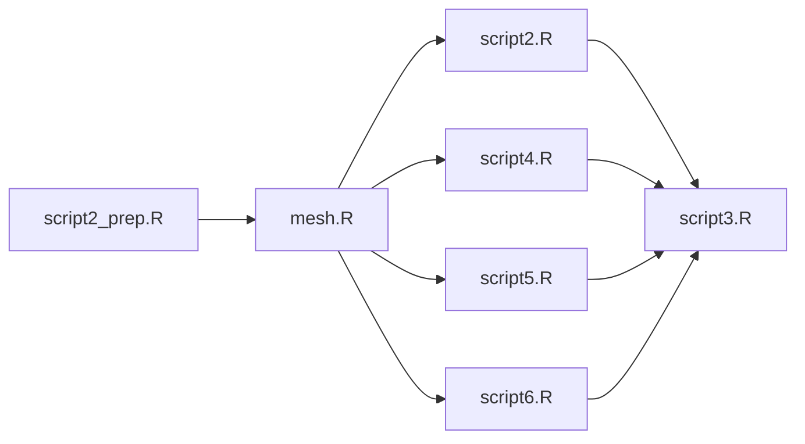

# Workflow

1. Compare model performance using 10-fold spatial cross-validation (CV)

2. Obtain model 2.1 performance on the grid (all measurements are fed to the model)

# Scripts

## Data Preparation

|  | Objective | Input | Output |
|--|-----------|-------| ------ |
| **script2_prep.R** | Clean and slice measurement data into 7-day windows | PM_AQS_2018.sas7bdat; grid_model_pm_o3_2018.sas7bdat; Relationship_File_AQS_Model_PM.sas7bdat | Measurement data (7-day windows); a descriptive table and an example plot presented in the slides |
| **grid.R** | Project grid locations from degrees to km in units and slice them into 7-day windows | grid_model_pm_o3_2018.sas7bdat; Relationship_File_AQS_Model_PM.sas7bdat | Grid data (7-day windows) |
| **mesh.R** | Experiment whether the mesh setting works in every week/fold | Measurement data (7-day windows) | - |

## Analysis

Output: 
1. Predictions (mean, sd, 95% lower/upper level) on monitor locations
2. Summaries of fixed parameters
3. Summaries of hyperparameters

|  | Objective | Sampling Method | Buffer Radius | Input |
|--|-----------|:---------------:|:-------------:|-------------|
| **script1.R** | Perform 10-fold CV | (Location, Day) | 100km | Measurement data (by specifying 7 consecutive days) |
| **script2.R** | Perform 10-fold CV | (Location, Day) | 100km | Measurement data (7-day windows) | 
| **script4.R** | Perform 10-fold CV | (Location) | 100km | Measurement data (7-day windows) |
| **script5.R** | Perform 10-fold CV | (Location) | 0km | Measurement data (7-day windows) |
| **script6.R** | Perform 10-fold CV | (Location) | 200km | Measurement data (7-day windows) |

## Generating Tables or Plots

|  | Objective | Input | Output |
|--|-----------|-------| ------ |
| **script3.R** | Create summary tables | Predictions of 10-fold CV from script2.R to script6.R | RMSE and coverage by quarters for all models |
| **2.1.R** | Run our final model 2.1 predicting to all grid locations | Measurement + grid data (7-day windows) | Predictions (mean, sd, 95% lower/upper level) on grid locations; summaries of fixed paramters & hyperparameters of model 2.1 |
| **2.1.plot.R** |  Create plots for our final model 2.1 | Predictions on grid locations; summaries of model 2.1 | Plots presented in the slides |

# Notes
1. Need to binary install INLA for HPC cluster
2. Library caret used to create folds does not work in cluster R sessions
   - soln: manually create folds using for loops
3. Coding error in defining buffers gets fixed
4. INLA crashes at some iterations (10th for script 1, many more for script 2) with errors reported as "fails to get good initial values"
   - soln: using pcmatern for SPDE, adding initial values for hyperparameters using script 1 results
6. Numerical issue: In script 2 inla.mesh.2d() takes forever to run in some job
   - problem caused by specifying boundary layer using max.edge = c(300, 600)
   - ~~soln: round loc argument to 5 digits~~
   - soln: tune max.edge, offset arguments in inla.mesh.2d(); define and specify boundary using all monitor locations

